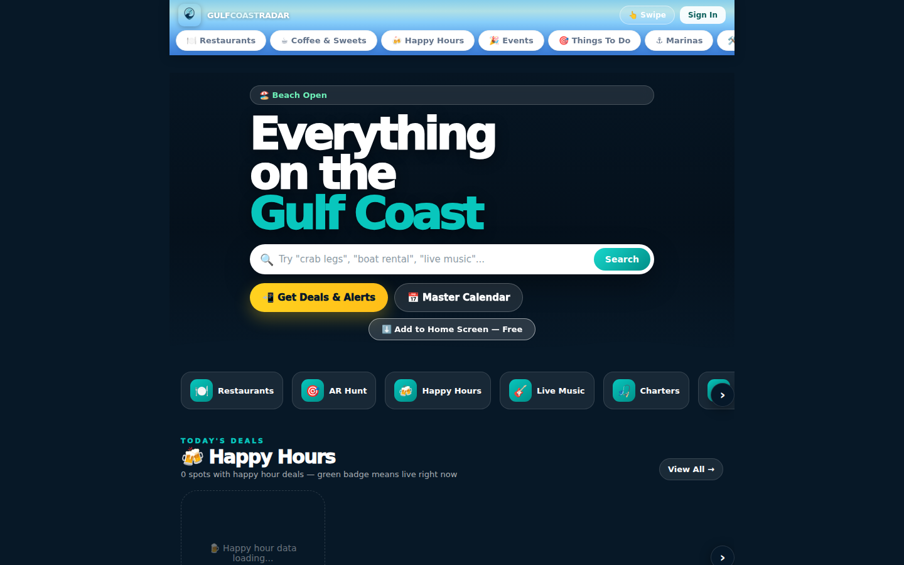
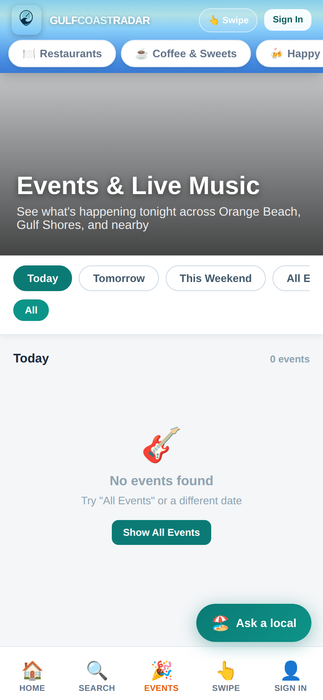

# GulfCoastRadar (gcr-unified)

The public **Gulf Coast Radar** site: a phone-first guide to restaurants, happy
hours, events and live music, things to do, charters and rentals, deals, an AR
hunt, group trips and itineraries, for Orange Beach, Gulf Shores and nearby.
React + Vite. It is the consumer side of the directory; the operator console and
the business owner's dashboard live in `Admin-dashboard-main` and
`Dashboards-users-`. It is **not** part of the Ghost box.

| Home (desktop) | Home (phone) | Events (phone) |
| --- | --- | --- |
|  |  |  |

*These captures come from this code run locally against a test backend that
returns no listings, so the deal, happy-hour and event lists are empty ("0
events"). They show the layout, not the live content.*

## Where it runs

Vercel project `gcr-unified` serves `gulfcoastradar.com` and
`www.gulfcoastradar.com`; a second project, `gcr-unified2`, is a separate
deployment (its git link is not visible from here). It reads through
`gcr-api-clean` (`VITE_API_BASE`).

## Run it

```bash
npm install
npm run dev        # vite
npm run build      # vite build, then scripts/prerender.mjs (postbuild)
npm run lint       # currently fails: there is no eslint.config.* file in the repo
npm run preview
```

`npm run build` needs network access: the postbuild step fetches entities from
`gcr-api-clean` and writes a static `dist/business/<slug>/index.html` (title, meta
tags, JSON-LD) for each one, plus `dist/sitemap.xml` and `dist/robots.txt`. A build
on 2026-09-29 prerendered 1000 pages: the script asks for up to 5000 entities, the API
returned 1000 (`CategoryPage.jsx` also notes a 1000-row API limit), and the script stops
after a short batch, so it does not page further.

Settings (names only): `VITE_API_BASE`, `VITE_SUPABASE_URL`, `VITE_SUPABASE_KEY`,
`VITE_DEFAULT_MODE`, `VITE_SMS_NUMBER`, and the `VITE_FIREBASE_*` web-app keys.
`VITE_SUPABASE_URL` defaults to the `cyber check` project; `.env.production` holds
the public client-side values. In `src/`, `VITE_SUPABASE_URL`/`VITE_SUPABASE_KEY` are
read only by `services/supabaseAuth.js`, and the `VITE_FIREBASE_*` keys only by
`services/firebaseAuth.js`; nothing imports either file (Auth.jsx has the Firebase
import commented out). `VITE_DEFAULT_MODE` is imported in `App.jsx` but never used.

## Pages

42 page files in `src/pages/`, 40 of them routed in `src/App.jsx` (`Browse.jsx` and
`Dashboard.jsx` are not routed; `/browse` redirects to `/`): `/` (Landing), `/home`,
`/search`, `/category/:category`, category pages (`/restaurants`, `/coffee`,
`/happy-hours`, `/events`, `/deals`, `/things-to-do`, `/ar-hunts`, `/public-spots`,
`/shopping`, `/nightlife`, `/wellness`, `/marinas`, `/feed`), a business
(`/business/:slug`, `/menu/:slug`, `/review/:slug` (a photo-submission form),
`/links/:slug`), artists (`/artists`,
`/artist/:slug`, `/artist/:slug/live`), stays and rentals (`/staying`, `/rental/:slug`,
`/book-rental/:slug`; `/stays` redirects to `/staying`), services and rides
(`/services`, `/service/:slug`,
`/book-service/:slug`, `/transportation/:slug`), booking (`/reserve/:slug`,
`/confirmation/:type/:id`), the swipe deck (`/swipe/:category`), trips
(`/itinerary`, `/groups`, `/group/:slug`, `/saves`, `/profile`, `/list`,
`/building`, `/setup/*`), sign-in (`/auth`, `/reset`, `/join`) and `/privacy`,
`/terms`. `/home`, `/setup/*`, `/list`, `/building`, `/itinerary`, `/profile`,
`/saves`, `/groups` and `/group/:slug` redirect to `/auth` without a login token
(`RequireAuth` in `App.jsx`). Sign-in is by phone number and a texted code; the
email and password form is still in `Auth.jsx` but unreachable, because the phone/email
toggle is commented out.

## Also in the repo

- **Standalone pages in `public/`**, served by the rewrites in `vercel.json`, not by
  React: `/p/:slug` (a business's page, `biz.html`), `/book/:slug/:app` (checkout with
  optional Stripe deposit, `book.html`), `/u/:code` (a visitor's shared picks),
  `/r/:slug` and `/reviews/:slug` (verified reviews), `/manage/:id` (cancel or
  reschedule a booking), `/waiver/:slug`, `/developers/reviews`, and
  `/:slug/profile` (artist song requests, `song-request.html`). All of them call
  `gcr-api-clean`. `embed.js` and `reviews-embed.js` are paste-in widgets for other
  sites. Also in `public/` and reached by file name: `rides.html` (ride request),
  `menu-update.html`, `review.html`, `card.html` (a personal contact card), `q.html`
  (QR code redirect). `booking.html` links `/css/sales.css` and `/js/sales-config.js`,
  which do not exist in this repo, and `qr-menu.html` is empty.
- **Every route change** posts a page view to `gcr-api-clean` (`/api/gcr/track`).
- **Business pages** (`/business/:slug`) show menus, hours, reviews, photos and
  booking links from `gcr-api-clean`, and have an "Is this your business?" claim form
  that posts to `/api/gcr/claim`. `/deals` lets a visitor post a deal
  (`/api/deals/submit`). A signed-in visitor gets an "Ask a local" chat (`/api/tourist/ai-chat`), an
  itinerary builder (`/api/tourist/build-itinerary`) and optional location sharing (a
  position sent every 30 seconds).
- `src/pages/Dashboard.jsx` is a partly built business dashboard (only its calendar tab
  does anything; the rest are placeholders) that no route reaches; the real dashboards
  are in the two repos named at the top.

## Scripts in the root

The `*.mjs` files in the repo root (`dump-entire-db`, `export-supabase-complete`,
`import-restaurants`, `verify-live` …) are one-off data export, import and
verification scripts from building the directory. They are not part of the site
build (`package.json` runs only `scripts/prerender.mjs`). Several import packages that
are not in `package.json` (`playwright`, `better-sqlite3`, `node-fetch`).

> **Secrets.** `dump-entire-db.mjs` and `export-supabase-complete.mjs` contain a
> Supabase `service_role` key, and `convert-db-to-organized-json.mjs`,
> `convert-sql-to-json.mjs` and `export-complete-all-data.mjs` contain a database
> connection string with its password, all in plain text and tracked in git. Rotate
> them and move them to environment variables. Separately, `.env.vercel` (a Vercel
> token) was tracked in earlier commits; it is now untracked and ignored.

## Related

- `gcr-unified-v2` is a copy of this repo started as the base for a
  structured-data rebuild; see its README.
- `gcr-api-clean` is the API this site reads.
